  <picture>
    <source media="(prefers-color-scheme: dark)" srcset="dark.svg">
    <source media="(prefers-color-scheme: light)" srcset="light.svg">
    
  </picture>

---

### 📊 Stats

 

---

## 🌐 GitHub Activity

  

---

✍️ *A random dev quote to close things out:*

